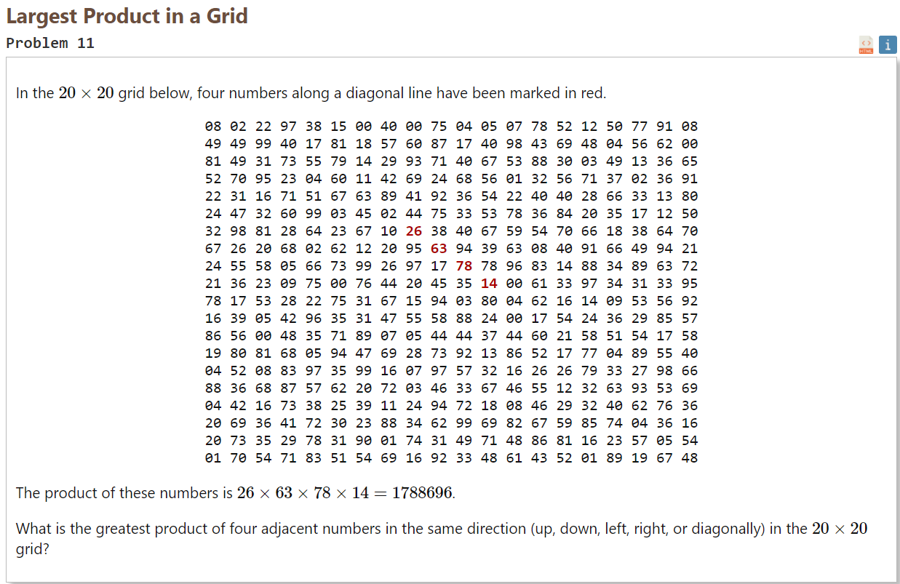
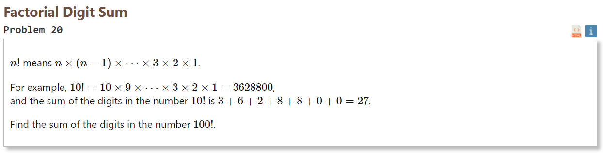

lab1
=====

## Task 11



``` erl
list_max(List) -> list_max(List, -1).

list_max([], Max) ->
    Max;
list_max([H | T], Max) ->
    list_max(T, mmax(H, Max)).

mmax(X, Y) ->
    if
        X > Y -> X;
        X =< Y -> Y
    end.

get_element_by_index(List, I, J) -> lists:nth(J, lists:nth(I, List)).

% Вычисление результата умножения определенного количества числе (ProductNumber) по определенному направлению в матрице с текущего индекса X(Row), Y(Col)
compute_product(Array, Row, Col, StepRow, StepCol, ProductNumber) ->
    compute_product(Array, Row, Col, StepRow, StepCol, ProductNumber - 1, 1).

compute_product(Array, Row, Col, _, _, 0, Acc) ->
    Acc * get_element_by_index(Array, Row, Col);
compute_product(Array, Row, Col, StepRow, StepCol, ProductNumber, Acc) ->
    CellValue = get_element_by_index(
        Array, Row + StepRow * ProductNumber, Col + StepCol * ProductNumber
    ),
    compute_product(Array, Row, Col, StepRow, StepCol, ProductNumber - 1, Acc * CellValue).

% вызов хвостовой рекурсии с указанными ограничениями на индексы и начальными значениями для умножения (можно реализовать передачу функции с указанными оператором, напр. +)
compute_max_product(Array, Max, MaxRow, MaxCol, MinRow, MinCol, StepRow, StepCol, ProductNumber) ->
    compute_max_product(
        Array, Max, MaxRow, MaxCol, MinRow, MinCol, StepRow, StepCol, ProductNumber, MinRow, MinCol
    ).

% Вычисляется результат умножения указанного количества элементов, по указанному направлению и по всем доступным по ограничениям индексам.
compute_max_product(_, Max, MaxRow, _, _, _, _, _, _, MaxRow, _) ->
    Max;
compute_max_product(
    Array, Max, MaxRow, MaxCol, MinRow, MinCol, StepRow, StepCol, ProductNumber, Row, Col
) when
    Row >= MinRow, Row =< MaxRow, Col >= MinCol, Col =< MaxCol
->
    Product = compute_product(Array, Row, Col, StepRow, StepCol, ProductNumber),
    NewMax = mmax(Max, Product),
    compute_max_product(
        Array, NewMax, MaxRow, MaxCol, MinRow, MinCol, StepRow, StepCol, ProductNumber, Row, Col + 1
    );
compute_max_product(
    Array, Max, MaxRow, MaxCol, MinRow, MinCol, StepRow, StepCol, ProductNumber, Row, _
) ->
    compute_max_product(
        Array, Max, MaxRow, MaxCol, MinRow, MinCol, StepRow, StepCol, ProductNumber, Row + 1, MinCol 
        % next row, min col
    ).

% Функция принимает двумерный массив и количество элементов, произведение которых будет искаться
max4mul(Array, ProductNumber) ->
    max4mul(Array, ProductNumber, 0).

max4mul(Array, ProductNumber, Max) ->
    Length = length(Array),
    RowMax = compute_max_product(Array, Max, Length, Length - ProductNumber, 1, 1, 0, 1, ProductNumber),
    ColMax = compute_max_product(Array, Max, Length - ProductNumber, Length, 1, 1, 1, 0, ProductNumber),
    DiagRMax = compute_max_product(Array, Max, Length - ProductNumber, Length - ProductNumber, 1, 1, 1, 1, ProductNumber),
    DiagLMax = compute_max_product(Array, Max, Length - ProductNumber, Length, 1, ProductNumber, 1, -1, ProductNumber),
    list_max([RowMax, ColMax, DiagRMax, DiagLMax]).
```

## Task 20



``` erl
% Вызов функции с общим для большинства случаев нейтральным по умножению элементом (1)
fac(X) -> fac(X, 1).

% Хвостовая рекурсия, с передачей аккумулятора. Для нахождения факториала необходимо каждый раз умножать его на текущее значение.
fac(0, Acc) -> Acc;
fac(X, Acc) -> fac(X - 1, X * Acc).

% Реализация суммы цифр числа рекурсивным методом 
sum_digit(0) -> 0;
sum_digit(X) -> sum_digit(X div 10) + X rem 10.

% Реализация суммы цифр числа хвостовой рекурсией
sum_digit_tailrec(X) -> sum_digit_tailrec(X, 0).

sum_digit_tailrec(0, Acc) -> Acc;
sum_digit_tailrec(X, Acc) -> sum_digit_tailrec(X div 10, Acc + X rem 10).

% Реализация суммы цифр числа с использованием сверточной функции fold
sum_digit_fold(X) ->
    Digits = integer_to_list(X),
    lists:foldl(fun(Digit, Acc) -> Acc + (Digit - $0) end, 0, Digits).
```
## Выводы
В результате выполнения данной лабораторной работы были изучены некоторые основы синтаксиса языка Erlang, на практике была изучена рекурсия/хвостовая рекурсия, как аналог циклов в других языках программирования. С примененением функциональной практики получилось решить одни и те же задачи как на функциональном, так и на мультипарадигменном языке программирования с хранением состояния(python) и его отсутствием(erlang). 
